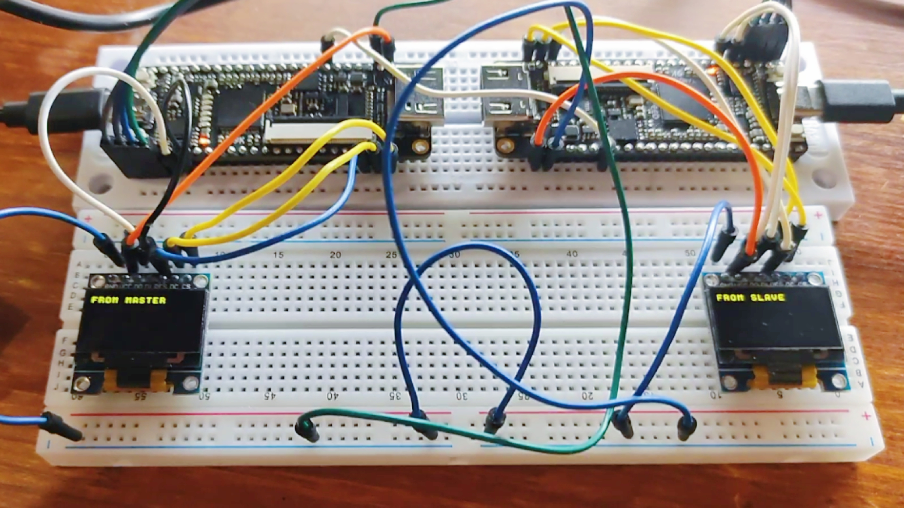
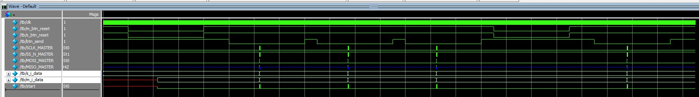
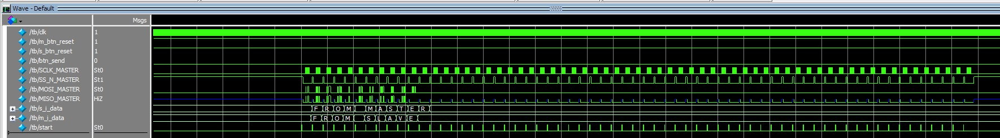
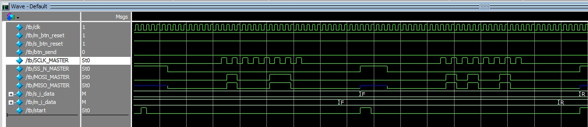
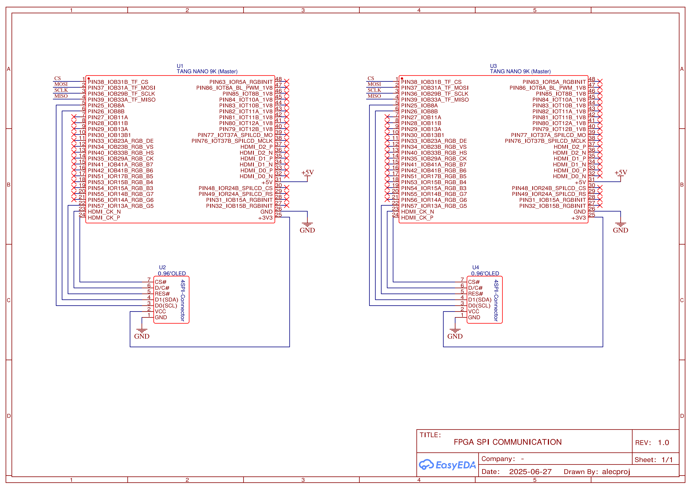

<div align="center">

# Two-way ASCII Character Transmission via SPI with Display Output
English | [Русский](./README.ru.md)
</div>

This project implements a bidirectional full-duplex transfer of ASCII characters between two **Tang Nano 9K** FPGAs, displaying the exchanged text on 0.96″ OLED screens (driver **SSD1306**) on both the master and slave devices.



In addition to the main functionality, the repository includes an implementation of bidirectional full-duplex transmission of 64-bit data. Files related to this feature are prefixed with `64`.

> [!NOTE]  
> This project uses the **GOWIN SPI IP core**.  
> You can find the official documentation on the [GOWIN website](https://www.gowinsemi.com/en/support/ip_detail/1/) and a Russian translation in the project’s `docs` directory.
## Overview

The project contains the following components:
- Source code for the master device (`master`)
- Source code for the slave device (`slave`)
- A testbench for verifying SPI interaction between devices (`testbench`)

> [!TIP]  
> For detailed descriptions of each component, see the **README** in the corresponding repository directories.

### Key Technologies

- [GOWIN EDA IDE](https://www.gowinsemi.com/en/support/home/) – development environment for Tang Nano FPGAs
- [GOWIN SPI IP](https://www.gowinsemi.com/en/support/ip_detail/1/) – IP core implementing SPI data transfer
- [ModelSim](https://www.intel.com/content/www/us/en/support/ru-banner-inside.html) – software for running and debugging testbenches

### How It Works

The message preloaded into the master’s firmware (in `master/MASTER/src/m_top.v`, inside the `Initial` block) is split into 8-bit blocks (one ASCII character each). Each block undergoes a 7-stage interaction with the SPI IP core, exchanging data with the slave. The received character is stored in a shift-register array that holds the full received message.

This array is continuously refreshed and rendered on the OLED display on each clock-edge. Transmission starts when the **Send** button is pressed and continues until the entire message (up to 64 characters, limited by screen size) has been sent.

The slave’s firmware works similarly but is simpler: it breaks its own 64-byte message into 8-bit blocks, loads the first block into a shift register, then waits for the master’s activity signal. Upon request, it exchanges the 8-bit data, and the received character is stored in its own display array, which is periodically updated.

Below are simulation results demonstrating the project in action.

### Simulation

Simulation sequence:
1. Initialize buttons
2. Wait 2 ms
3. Reset master and slave modules
4. Wait 6 ms
5. Release reset buttons
6. Wait 2 ms
7. Press the **Send** button
8. Wait 6 ms
9. Release **Send** button
10. Perform two additional transfers
11. Reset again
12. Transfer again
#### Full Simulation


#### 64-Byte Transfer


#### Single-Byte Transfer



# Quick Start

## Hardware Setup

You will need:
- Two [Tang Nano 9K development boards](https://wiki.sipeed.com/hardware/en/tang/Tang-Nano-9K/Nano-9K.html)
- Two 0.96″ [OLED displays](http://www.lcdwiki.com/res/MSP096X/0.96inch_OLED_SPI_Module_MSP096X_User_Manual_EN.pdf) (driver [SSD1306](https://learn.lushaylabs.com/content/files/2022/08/SSD1306.pdf))

**Wire the components as shown:**



> [!WARNING]  
> The boards are connected by six wires (SPI lines, 5 V, and GND). For proper SPI operation, their clock generators must be synchronized, so **only one** board should be powered from an external supply.
## Software Setup

### Installing GOWIN EDA

Install and configure GOWIN EDA IDE by following the [official SiPEED guide](https://wiki.sipeed.com/hardware/en/tang/Tang-Nano-Doc/install-the-ide.html).
### Cloning and Building the Project

1. Clone the repository:
    ```sh
    git clone https://github.com/alecproj/circuit-spi-display.git
    ```
2. Open `master/MASTER/MASTER.gprj` in GOWIN EDA and program the first board (master).
3. Open `slave/SLAVE/SLAVE.gprj` and program the second board (slave).

> [!NOTE]  
> To rebuild the GOWIN SPI IP core, see [Building the GOWIN SPI IP core](./master/README.md#building-the-gowin-spi-ip-core).
## Running the System

1. Press **S2** on both boards to reset the FPGAs.
2. Press **S1** on the master to start the bidirectional transfer.

The slave’s display will show the master’s message (default `"FROM MASTER"`), and the master’s display will show the slave’s message (default `"FROM SLAVE"`).
## Running Testbenches

To simulate without hardware, install ModelSim from the [official Intel site](https://www.intel.com/content/www/us/en/support/ru-banner-inside.html). Then follow the [simulation instructions](./testbench/README.md).