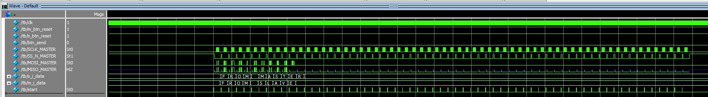

<div align="center">

# Двухсторонняя передача ASCII символов по SPI с выводом на дисплей
[English](./README.md) | Русский
</div>

Данный проект реализует двустороннюю полнодуплексную передачу ASCII-символов между двумя ПЛИС **Tang Nano 9K** с последующим выводом текста на OLED-дисплеи (размер 0,96 дюйма, драйвер **SSD1306**) как на ведущем, так и на ведомом устройстве.


В дополнение к основной функциональности в репозитории представлена реализация двусторонней полнодуплексной передачи 64-битных данных. Файлы, относящиеся к данной реализации, помечены префиксом `64`.

> [!NOTE]  
> В проекте используется **SPI IP-модуль от GOWIN**.  
> Ознакомиться с официальной документацией можно на [сайте GOWIN](https://www.gowinsemi.com/en/support/ip_detail/1/), а также в директории [`docs`](./docs) проекта, где представлен перевод на русский язык.
## Обзор

Проект включает следующие компоненты:
- Исходный код ведущего устройства (`master`)
- Исходный код ведомого устройства (`slave`)
- Тестбенч для проверки взаимодействия устройств на уровне SPI (`testbench`)

>[!TIP]
>Подробное описание компонентов проекта представлено в **README** соответствующих директорий репозитория.
### Ключевые технологии

- [GOWIN EDA IDE](https://www.gowinsemi.com/en/support/home/) - среда разработки для ПЛИС Tang Nano
- [GOWIN SPI IP](https://www.gowinsemi.com/en/support/ip_detail/1/) - IP-модуль реализующий передачу даннх по протоколу SPI
- [MODELSIM](https://www.intel.com/content/www/us/en/support/ru-banner-inside.html) - программное обеспечение для запуска и отладки тестбенчей

### Как это работает

Сообщение, заранее записанное в прошивке ведущего устройства (файл `master/MASTER/src/m_top.v`, блок `Initial`), разбивается на блоки по 8 бит (1 ASCII-символ). Для каждого такого блока осуществляется 7-этапное взаимодействие с SPI IP-модулем, в ходе которого происходит обмен данными с ведомым устройством. Полученный символ заносится в массив шин, содержащий всё принятое сообщение.

Этот массив регулярно обновляется и отображается на OLED-дисплее по фронту тактового сигнала. Передача данных начинается после нажатия кнопки **Send** и продолжается до тех пор, пока не будет передано всё сообщение (максимум 64 символа — ограничение обусловлено размером экрана).

Прошивка ведомого устройства устроена проще. Оно аналогично разбивает своё сообщение (64 байта) на блоки по 8 бит, записывает первый блок в сдвиговый регистр, затем ожидает сигнала активности от мастера. При поступлении запроса осуществляется обмен 8-битными данными, и принятый символ также сохраняется в массив, который периодически отображается на дисплее.

Ниже приведены результаты симуляции, демонстрирующие работу проекта.
### Симуляция

Сценарий симуляции:
1. Инициализация кнопок
2. Пауза 2 мс
3. Сброс модулей мастер и слейв
4. Пауза 6 мс
5. Отпускание кнопок сброса
6. Пауза 2 мс
7. Нажатие кнопки отправки (Send)
8. Ожидание 6 мс
9. Отпускание кнопки отправки
10. Повтор двух дополнительных передач
11. Повторный сброс
12. Снова передача

#### Общий вид симуляции


#### Передача 64 байт


#### Передача 1 байта


# Быстрый страт

## Подготовка оборудования

Вам понадобится:
- Две отлодочные платы [Tang Nano 9K](https://wiki.sipeed.com/hardware/en/tang/Tang-Nano-9K/Nano-9K.html)
- Два [OLED дисплея 0.96 дюйма](http://www.lcdwiki.com/res/MSP096X/0.96inch_OLED_SPI_Module_MSP096X_User_Manual_EN.pdf) (драйвер [SSD1306](https://learn.lushaylabs.com/content/files/2022/08/SSD1306.pdf))

**Подключите компоненты согласно схеме:**


>[!WARNING]
>Платы соединены между собой 6 проводами (SPI линии, 5V и GND).  
> Для корректной работы SPI тактовые генераторы плат должны быть синхронизированы, поэтому к внешнему источнику питания необходимо подключить **только одну** плату.
## Подготовка ПО

### Установка GOWIN EDA

Установите и настройте GOWIN EDA IDE, следуя [официальному руководству от SiPEED](https://wiki.sipeed.com/hardware/en/tang/Tang-Nano-Doc/install-the-ide.html). 
### Клонирование и сборка проекта

1. Клонируйте репозиторий проекта:
    ```sh
    git clone https://github.com/alecproj/circuit-spi-display.git
    ```
2. Откройте проект `master/MASTER/MASTER.gprj` и прошейте первую плату (она будет ведущей).
3. Откройте проект `slave/SLAVE/SLAVE.gprj` и прошейте вторую плату (она будет ведомой).

>[!NOTE]
>При необходимости пересборки SPI IP-модуля от GOWIN см. раздел [Сборка SPI IP модуля GOWIN](./master/README.ru.md#сборка-spi-ip-модуля-gowin).
## Запуск

1. Поочередно нажмите кнопку **S2** на обеих платах для сброса ПЛИС.
2. Нажмите кнопку **S1** на ведущем устройстве для запуска двусторонней передачи.

На дисплее ведомого устройства отобразится сообщение от ведущего (по умолчанию `"FROM MASTER"`), а на дисплее ведущего — сообщение от ведомого (по умолчанию `"FROM SLAVE"`).
## Запуск тестбенчей

Для запуска симуляции без физического оборудования установите ModelSim, доступный на [официальном сайте](https://www.intel.com/content/www/us/en/support/ru-banner-inside.html).

Далее следуйте [инструкции по запуску симуляции](./testbench/README.ru.md).
