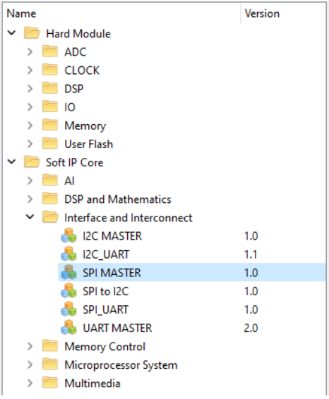
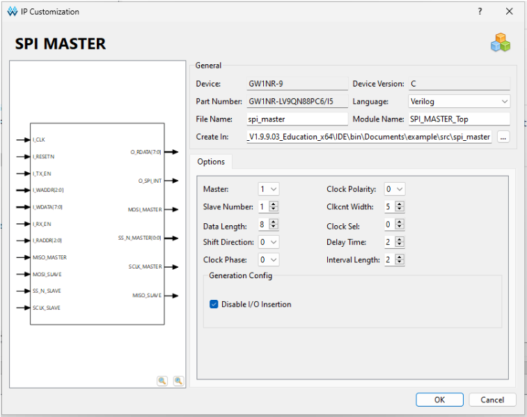

<div align="center">

# Master Device Firmware
English | [Русский](./README.ru.md)
</div>

## Overview

This section provides the implementation of the **master device** for full-duplex data exchange between Tang Nano 9K FPGAs over SPI.

Core features:
- SPI transaction management
- Text output to an SSD1306-driven OLED display
- Handling of incoming/outgoing messages
- Button detection (send, reset) with software debouncing

## File Structure

### 64MASTER Directory

The 64-bit data transfer implementation locates in the `64MASTER` directory. It mirrors the main project’s structure, except it omits the OLED-display interface.

### Main Project Layout

The main project files live in `MASTER` and are organized as follows:

|File|Description|
|---|---|
|`m_top.v`|Top-level module: manages OLED, SPI, buttons, and data buffers|
|`m_spi_control.v`|SPI controller: implements the 7-stage interaction with the IP core|
|`m_screen.v`|OLED driver: initializes the display and renders characters|
|`font.hex`|ASCII font for on-screen rendering|
|`spi_master/`|Directory containing the external SPI IP core|

## Module Lifecycle

1. **Initialization**
    - Load font from `font.hex`
    - Reset message buffers and registers
    - Initialize OLED display via `m_screen.v`
2. **Input Handling**
    - `btn_send`: trigger transmission of `o_message[]` buffer
    - `btn_reset`: reset registers and clear the display
3. **Data Transmission**
    - On `btn_send`, initiate the 7-stage SPI IP-core sequence
    - Send characters sequentially over MOSI
4. **Data Reception**
    - Received characters stored in `i_message[]` buffer
5. **Display Update**
    - Continuously refresh the OLED with the received-message buffer

## 7‑Stage SPI IP‑Core Sequence

> Implemented in `m_spi_control.v`

Interaction with the SPI IP core proceeds in 7 steps, indexed by `wr_index`:

1. **Select Slave**
    `write ssmask`: set `SSMASK = 0x01`
    - Asserted at start (`start`), sets `is_sending = 1`
2. **Configure SPI**
    `write control reg`: set `CONTROL = 0x8B`    
    - Master mode; reset flags; enable TX/RX
3. **Wait for Ready**
    - `read status reg`: poll `TX_READY` (bit 5) and `TX_EMPTY` (bit 4)
4. **Send Data**
    `write data`: write 8 bits from `o_message[]` into `TXDATA`
    - Full-duplex: RX begins simultaneously
5. **Wait for Receive Complete**
    `read status reg`: poll `RX_READY` (bit 6)
6. **Read Received Data**
    `read data`: read 8 bits from `RXDATA` into `i_message[]`    
7. **End Transaction**
    `write control reg`: set `CONTROL = 0x00`
    - Clear `is_sending`, ready for next transfer    

> [!NOTE]  
> **Key point**: `is_sending` locks out external control while the sequence runs.

> [!TIP]  
> See the SPI IP‑core documentation in [docs/](../docs) for more details.

## Implementation Details

> Implemented in `m_top.v`

1. **Button Handling**
    - Debounce via 8-bit shift register
    - `btn_send` launches `"FROM MASTER"` transmission
    - `btn_reset` clears buffers and resets the display
2. **Data Buffers**
    ```verilog
    reg [7:0] i_message [63:0]; // Incoming data buffer
    reg [7:0] o_message [63:0]; // Outgoing data buffer ("FROM MASTER")
    ```
3. **Synchronization**
    - `is_sending` prevents buffer changes during transfer
    - `o_change_rd` gates updates to outgoing data
    - `i_change_rd` controls writes to the received-data buffer

## Building the GOWIN SPI IP Core

To rebuild and import the SPI IP core:

1. Open the project in the GOWIN EDA IDE.
2. From the toolbar, select **IP Modules**:  
    
3. Navigate to **Soft IP Core → Interface and Interconnect → SPI MASTER**.  
    
4. In the configurator, apply these settings:  
    
5. Click **OK** to generate the module at the specified path and file name.