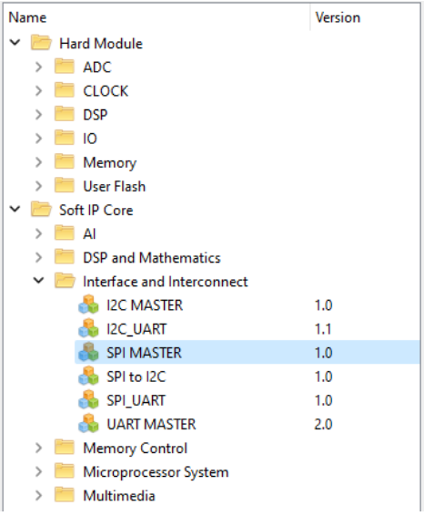
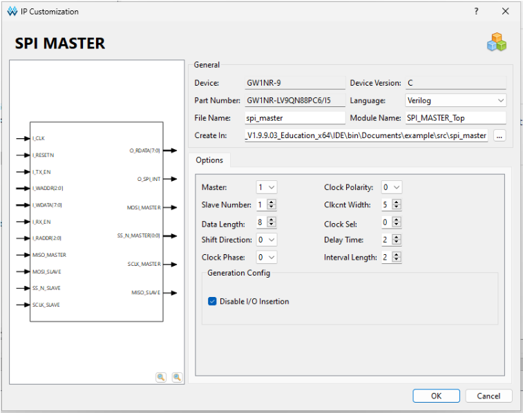

<div align="center">

# Прошивка ведущего устройства (MASTER)
[English](./README.md) | Русский
</div>

## Обзор

Данный раздел содержит реализацию **ведущего устройства (MASTER)** для двунаправленного обмена данными между FPGA Tang Nano 9K через SPI. 

Основные функции:
- Управление SPI-транзакциями
- Вывод текста на OLED-экран через драйвер SSD1306
- Обработка входящих/исходящих сообщений
- Детектирование нажатий кнопок (отправка данных, сброс) с программным антидребезгом 

## Структура файлов

### Директория 64MASTER

Файлы проекта по передаче 64-битных данных расположены в директории `64MASTER`. Реализация имеет структуру, аналогичную основному проекту, с единственным отличием — отсутствием функции взаимодействия с OLED-дисплеем.

### Структура основного проекта

Реализация основного проекта находится в директории `MASTER` и имеет следующую структуру:

| Файл              | Описание                                                         |
| ----------------- | ---------------------------------------------------------------- |
| `m_top.v`         | Верхнеуровневый модуль: управление OLED, SPI, кнопками и данными |
| `m_spi_control.v` | Контроллер SPI: реализация 7-этапного взаимодействия с IP-ядром  |
| `m_screen.v`      | Драйвер OLED-дисплея: инициализация экрана и вывод символов      |
| `font.hex`        | Шрифт ASCII для отображения символов на экране                   |
| `spi_master/`     | Директория с IP-ядром SPI (внешний модуль)                       |
## Жизненный цикл модуля

1. Инициализация:
    - Загрузка шрифта из `font.hex`
    - Сброс буферов сообщений и других регистров
    - Инициализация OLED-экрана (через `m_screen.v`)
2. Обработка ввода:
    - Кнопка `btn_send`: запуск передачи сообщения из буфера o_message\[ \]
    - Кнопка `btn_reset`: сброс регистров и экрана
3. Передача данных:
    - При нажатии `btn_send` запускается 7-этапное взаимодействие с SPI IP-модулем
    - Символы последовательно передаются через MOSI
4. Приём данных:
    - Принятые символы сохраняются в буфер `i_message[]`
5. Отображение:
	- Буфер принятого сообщения циклически отображется на OLED-экране

## 7-этапное взаимодействие с SPI IP-модулем 

> реализовано в `m_spi_control.v`

Взаимодействие с SPI IP-ядром происходит через последовательность из 7 шагов, управляемых регистром `wr_index`:

1. **Указание ведомого устройства**  
    `write ssmask`: Установка маски SLAVE через `SSMASK = 0x01`
    - Устанавливается при старте передачи (`start`)
    - Флаг `is_sending` переводится в `1`
2. **Конфигурация режима работы**  
    `write control reg`: Инициализация SPI через `CONTROL = 0x8B`
    - Включает режим мастер, производит сброс флагов, активирует передачу/приём
3. **Проверка готовности**  
    `read status reg`: Ожидание флагов `TX_READY` и `TX_EMPTY`
    - Бит 5: Готовность передатчика
    - Бит 4: Буфер передатчика пуст
4. **Передача данных**  
    `write data`: Отправка символа через `TXDATA` (8 бит)
    - Данные берутся из буфера `o_message[]`
    - Полнодуплексный режим: одновременно с передачей начинается приём
5. **Ожидание завершения**  
    `read status reg`: Проверка флага `RX_READY` (бит 6)
    - Подтверждение успешного приёма данных
6. **Считывание данных**  
    `read data`: Чтение символа из `RXDATA`
    - Сохранение в буфер `i_message[]` для отображения на экране
7. **Завершение сеанса**  
    `write control reg`: Сброс через `CONTROL = 0x00`
    - Флаг `is_sending` возвращается в `0`
    - Модуль готов к новой транзакции

> [!NOTE]
> **Ключевая особенность**: Флаг `is_sending` блокирует внешние вмешательства на время выполнения последовательности.

>[!TIP]
>Для лучшего понимания принципов взаимодействия с SPI IP-модулем рекомендуется ознакомиться с документацией к нему в разделе [docs/](../docs)
## Особенности реализации

> реализовано в `m_top.v`

1. **Обработка кнопок**:  
   - Антидребезговая фильтрация через 8-битный сдвиговый регистр
   - Кнопка `btn_send`: запускает передачу сообщения "FROM MASTER"
   - Кнопка `btn_reset`: сбрасывает буферы и экран
2. **Буферизация данных**:
   ```verilog
   reg [7:0] i_message [63:0]; // Буфер входящих данных
   reg [7:0] o_message [63:0]; // Буфер исходящих данных ("FROM MASTER")
   ```
3. **Механизм синхронизации**:
   - Флаг `is_sending` запрещает изменение буферов во время транзакции
   - Сигнал `o_change_rd` контролирует обновление исходящих данных
   - Сигнал `i_change_rd` управляет записью принятых данных

## Сборка SPI IP модуля GOWIN

Инструкция по сборке (пересборке) и импорту IP-модуля:
1. Запустите проект в среде разработки.  
2. На панеле инструментов найдите меню IP модулей и откройте его:
   
3. Перейдите в директорию `Soft IP Core/Interface and Interconnect/` и откройте модуль `SPI MASTER`.  
     
4. Откроется конфигуратор, где необходимо повторить следующие настройки:
   
5. Далее, когда параметры введены, нажмите `ОК`. 
	В проект будет добавлен модуль по указанному ранее пути (Create In) и имени файла модуля (File Name).