<div align="center">

# Project Simulation
English | [Русский](./README.ru.md)
</div>

## Section Contents

- [TB Simulation](./README.md#tb-simulation)
- [64TB Simulation](./README.md#64tb-simulation)
- [Simulation Run Guide](./README.md#simulation-run-guide)
    - [Introduction](./README.md#introduction)
    - [Installation](./README.md#installation)
    - [Creating a Project](./README.mdd#creating-a-project)
    - [Running the Simulation](./README.md#running-the-simulation)
    - [Restarting the Simulation](./README.md#restarting-the-simulation)
## TB Simulation

Simulation sequence:

1. Initialize buttons
2. Wait 2 ms
3. Reset master and slave modules
4. Wait 6 ms
5. Release reset buttons
6. Wait 2 ms
7. Press the **Send** button
8. Wait 6 ms
9. Release the **Send** button
10. Perform two additional transfers
11. Reset again
12. Transfer again

#### Full Simulation View


#### 64-Byte Transfer


#### Single-Byte Transfer


## 64TB Simulation

The simulation sequence is identical to the previous one.

#### Full Simulation View

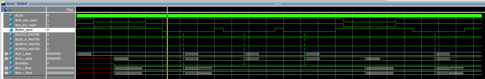
#### 64-Bit Transfer

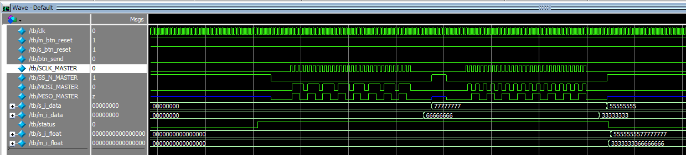
#### Close-up of 64-Bit Transfer

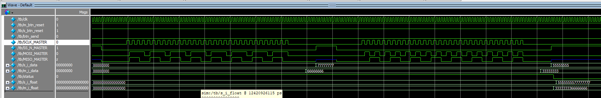

## Simulation Run Guide

### Introduction

ModelSim is Mentor Graphics’ Verilog simulation environment, offering extensive features including step-by-step debugging. This tool was chosen because simpler simulators cannot handle projects that use GOWIN’s built-in IP cores. Unfortunately, Icarus Verilog does not support compiling these designs, making **iverilog** unusable for this purpose.

This guide covers only the basic functions of ModelSim. For clarity, all steps are shown in the graphical interface, but using the console interface is equally functional.
### Installation

According to GOWIN, ModelSim may be bundled with the GOWIN EDA software, but in my installation it was not present. Download the latest ModelSim version from the [official Intel site](https://www.intel.com/content/www/us/en/software-kit/750368/modelsim-intel-fpgas-standard-edition-software-version-18-1.html). It supports both Windows and Linux.

The installation process is straightforward and needs no further explanation.
### Creating a Project

In ModelSim, each simulation must reside in its own project. On startup, ModelSim displays a release info dialog with a link to the user guide.

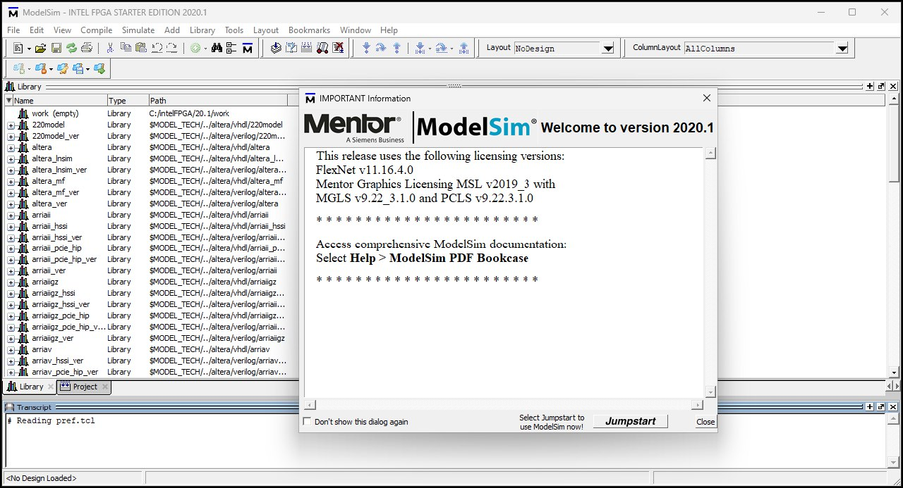

Click **Jumpstart**, then choose to create a new project.

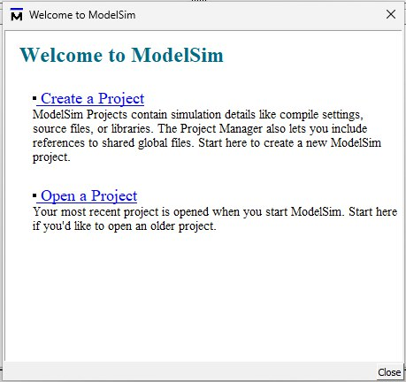

In the dialog, specify:
- **Simulation project name**
- **Project location**
- **Working library name** (arbitrary). This library will hold your Verilog modules.

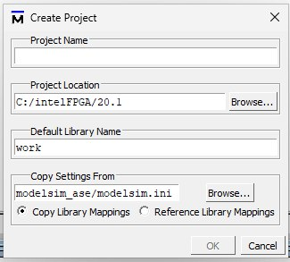

Next, add files: you may copy them into the project or link them from their original locations. Add files in this order:

1. **FPGA vendor simulation library**:
    - Provided with example testbenches on GOWIN’s site.
    - For this project: `./simlib/gw1n/prim_sim.v`.
2. **Built IP core file** (`.vo`):
    - Found under `TB/src/spi_master/spi_master.vo` after IP generation.
3. **Project Verilog modules** (excluding the testbench), in any order.
4. **Testbench file**, added last.

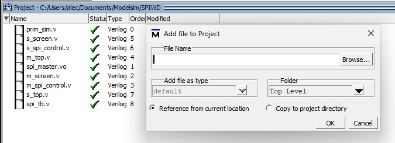

Compile by selecting **Compile → Compile All**.

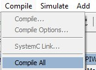
The compilation status appears in the console.

### Running the Simulation

After successful compilation:

1. Go to **Simulate → Start Simulation**.  
    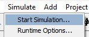
2. Enter the testbench path as:
    ```
    <environment>.<testbench_module_name>
    ```
    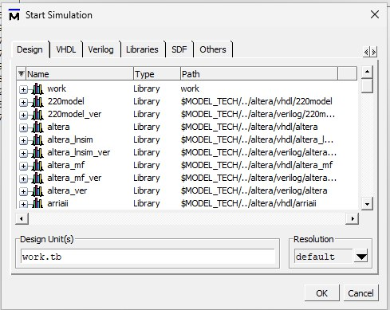
3. Click **OK**. Windows for **Objects**, **Wave**, and **Project** will open.

In **Objects**, select signals to analyze, right-click, and choose **Add Wave**.

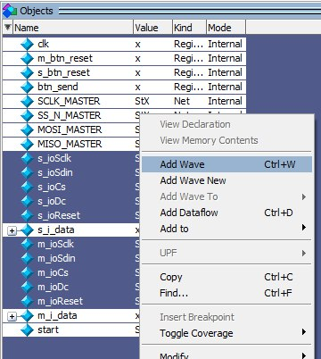

Switch to the **Wave** window. To run:
	**Simulate → Run → Run - All**.
	
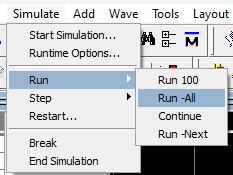

When the simulation ends, a dialog appears—**click “No”**.

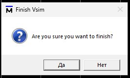

Now inspect waveforms in **Wave**. You can change display formats:


### Restarting the Simulation

To rerun after source changes:
1. Recompile files in the **Project** window.
2. Select **Simulate → Restart**.
    - Uncheck **Logged Signals** for a clean waveform.  
        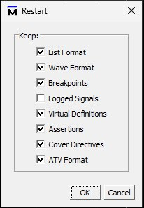
3. Then **Simulate → Run → Run - All**.

The simulation will restart, ready for analysis.
