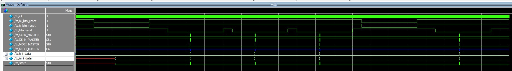
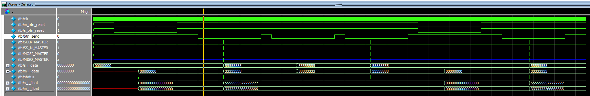
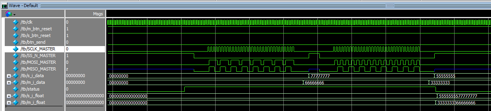
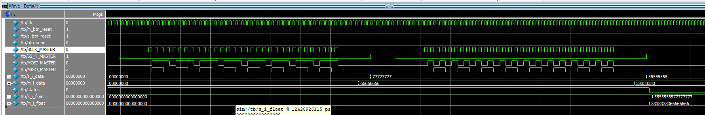
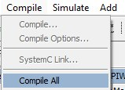
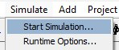
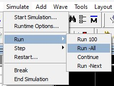
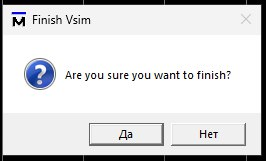
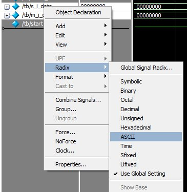

<div align="center">

# Симуляция проекта 
[English](./README.md) | Русский
</div>

## Содержание раздела

- [Симуляция TB](#симуляция-tb)
- [Симуляция 64TB](#симуляция-64tb)
- [Руководство по запуску симуляций](#руководство-по-запуску-симуляций)
	- [Введение](#введение)
	- [Установка](#установка)
	- [Создание проекта](#создание-проекта)
	- [Запуск симуляции](#запуск-симуляции)
	- [Перезапуск симуляции](#перезапуск-симуляции)
## Симуляция TB

Сценарий симуляции:
1. Инициализация кнопок
2. Пауза 2 мс
3. Сброс модулей мастер и слейв
4. Пауза 6 мс
5. Отпускание кнопок сброса
6. Пауза 2 мс
7. Нажатие кнопки отправки (Send)
8. Ожидание 6 мс
9. Отпускание кнопки отправки
10. Повтор двух дополнительных передач
11. Повторный сброс
12. Снова передача

#### Общий вид симуляции


#### Передача 64 байт


#### Передача 1 байта


## Симуляция 64TB

Сценарий симуляции аналогичный предыдущему.
#### Общий вид симуляции


#### Передача 64 бит


#### Приближенная передача 64 бит



## Руководство по запуску симуляций

### Введение

ModelSim — это среда симуляции программ на Verilog от компании Mentor Graphics, обладающая широким функционалом, включая возможность пошаговой отладки программ.  

Выбор данной среды обусловлен невозможностью использования более простых инструментов для симуляции проектов, которые задействуют встроенные IP-модули от GOWIN. К сожалению, компилятор Icarus Verilog не поддерживает компиляцию таких программ, и использование пакета **iverilog** для этой задачи невозможно.

В данном руководстве будут рассмотрены только базовые функции ModelSim. Для лучшей наглядности все описываемые действия будут демонстрироваться в графическом интерфейсе программы, однако использование графической оболочки не является обязательным. Консольный интерфейс ModelSim ничем не уступает графическому по функциональности.
### Установка

По заявлениям компании Gowin, среда ModelSim может поставляться вместе с программным обеспечением **Gowin EDA**, но в моем случае она отсутствовала в установленной директории.

Последнюю версию ModelSim можно скачать с [официального сайта Intel](https://www.intel.com/content/www/us/en/software-kit/750368/modelsim-intel-fpgas-standard-edition-software-version-18-1.html). Она поддерживается на операционных системах Windows и Linux.

Процесс установки не имеет особенностей и не требует дополнительных пояснений.
### Создание проекта

Для симуляции в среде ModelSim для каждого проекта необходимо создать отдельный проект.

По умолчанию при запуске ModelSim открывается диалоговое окно с информацией о релизе и ссылкой на руководство пользователя.  

  

В этом окне нужно нажать `Jumpstart`. Далее программа предложит создать новый проект или открыть существующий. Выберем создание нового проекта.  


В открывшемся диалоговом окне требуется указать:
- **название проекта симуляции**,
- **путь к проекту**,
- **имя рабочей библиотеки** (окружения). Имя может быть любым. Эта библиотека впоследствии будет содержать модули Verilog проекта.  
    

После этого появится запрос на создание нового файла или добавление существующего. Добавляемые файлы могут быть либо скопированы в проект, либо подключены как ссылки на файлы в других директориях (по умолчанию).

На данном этапе следует добавить файлы проекта на Verilog в определенной последовательности:

1. **Файл библиотеки симуляции для серии ПЛИС**:
    - Файлы библиотек для поддерживаемых ПЛИС обычно поставляются вместе с тестбенчами проектов-примеров, доступных на официальном сайте Gowin.
    - В данном случае необходимый файл - [./simlib/gw1n/prim_sim.v](./simlib/gw1n/prim_sim.v).
2. **Файл встроенного IP-модуля** (с расширением `.vo`):
    - После генерации IP-модулей их файлы сохраняются в папке **src** в корне проекта ([./TB/src/spi_master/spi_master.vo](./TB/src/spi_master/spi_master.vo)).
3. **Файлы модулей проекта**:
    - Добавляем все модули, кроме тестбенча, в любом порядке.
4. **Файл тестбенча**:
    - Добавляется последним.  


После добавления файлов необходимо выполнить их компиляцию. Для этого во вкладке `Compile` выберите пункт `Compile All`.  

  

Статус компиляции будет отображен в консоли.
### Запуск симуляции

Когда все файлы успешно скомпилированы, можно приступить к симуляции.

1. Перейдите во вкладку `Simulate` и выберите `Start Simulation`.  
    
2. В открывшемся окне укажите путь к файлу тестбенча в формате:
```
<окружение>.<имя_модуля_тестбенча>
```


3. Нажмите `OK`. После этого в программе откроются окна `Objects`, `Wave`, `Project`.

В окне `Objects` будут перечислены все сигналы (wire) тестбенча. Выделите нужные для анализа, нажмите правой кнопкой мыши и выберите `Add Wave`.  


Затем перейдите в окно `Wave`.

Для запуска симуляции во вкладке `Simulate` выберите `Run`, затем `Run -All`.  



После завершения симуляции появится всплывающее окно. **Обязательно нажмите "Нет"**.  



Теперь можно перейти в окно `Wave` для анализа.

Отображение данных можно настроить, изменив их формат:  



### Перезапуск симуляции

Для повторного запуска симуляции после изменения исходных файлов проекта не нужно заново выполнять все шаги.

1. Перейдите в окно проекта и выполните повторную компиляцию файлов.
2. Во вкладке `Simulate` выберите `Restart`.
    - Во всплывающем окне уберите галочку с пункта **Logged Signals**, если требуется чистая симуляция без сохранения предыдущих волн.  
        
3. Затем выберите `Simulate` -> `Run` -> `Run -All`.

Перезапуск завершен, можно анализировать обновленную симуляцию.
